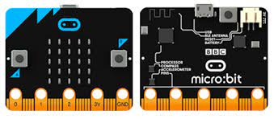
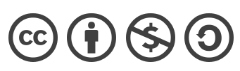

# Microbit
## Introducción
- ### ¿Que es STEAM? 
El término STEAM surge de las siglas en inglés de:  Science, Technology, Engineering, Arts & Mathematics.
- ### ¿Que es una placa Microbit?
 Es una computadora de bolsillo, que te presenta cómo el software y el hardware funcionan juntos.

Tiene una pantalla de luz LED, botones, sensores y muchas características de entrada/salida que, al se programado, te permiten interactuar contigo.

## [Módulo1: La placa Microbit y sus elementos](modulo1.md)
## Módulo2: Programación básica  1 
## Modulo 3: Programación básica 2
## Modulo 4: Ampliación
## Proyecto
## Licencia

