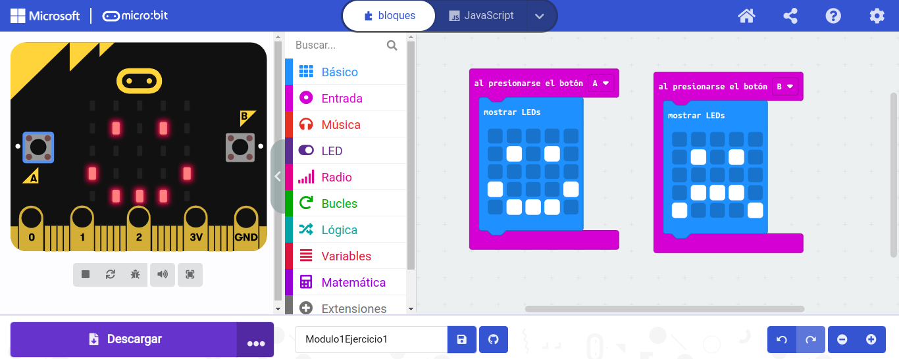
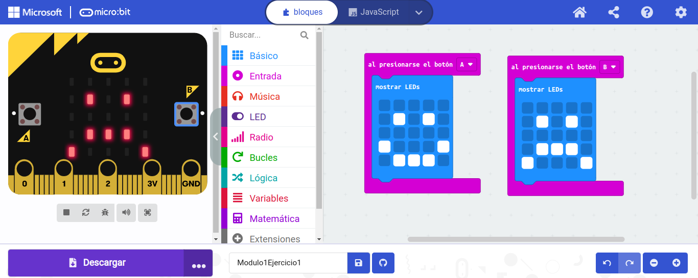
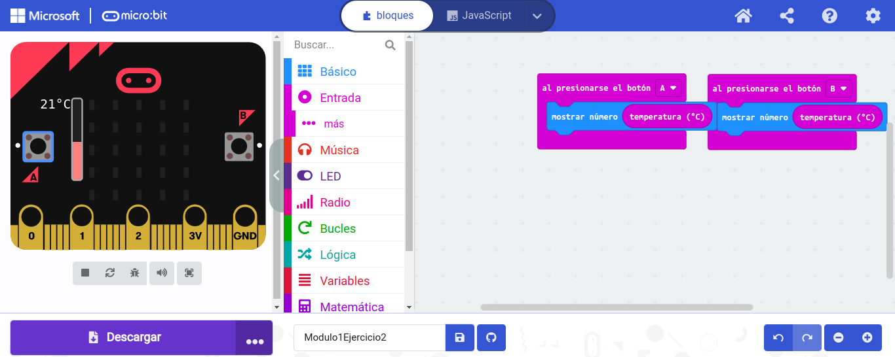
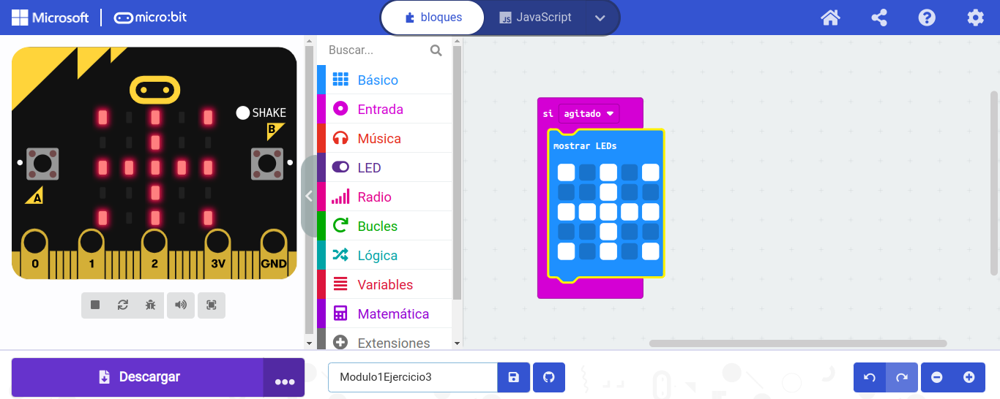

## Actividad 1: En nuestra primera actividad vamos a hacer que la placa muetre una cara feliz al pulsar el botón A, y una cara triste al pulsar el botón B.

## - [ARCHIVO](microbit-Modulo1Ejercicio1.hex) 

## Actividad 2: En esta actividad vamos a utilizar el sensor de temperatura para mostrar sus valores en pantalla al presionar los botones A y B.

## - [ARCHIVO](microbit-Modulo1Ejercicio2.hex)

## Actividad 3: Diseña tu propio programa para que la microbit muestre en pantalla un icono si es agitado.

## - [ARCHIVO](microbit-Modulo1Ejercicio3.hex)
