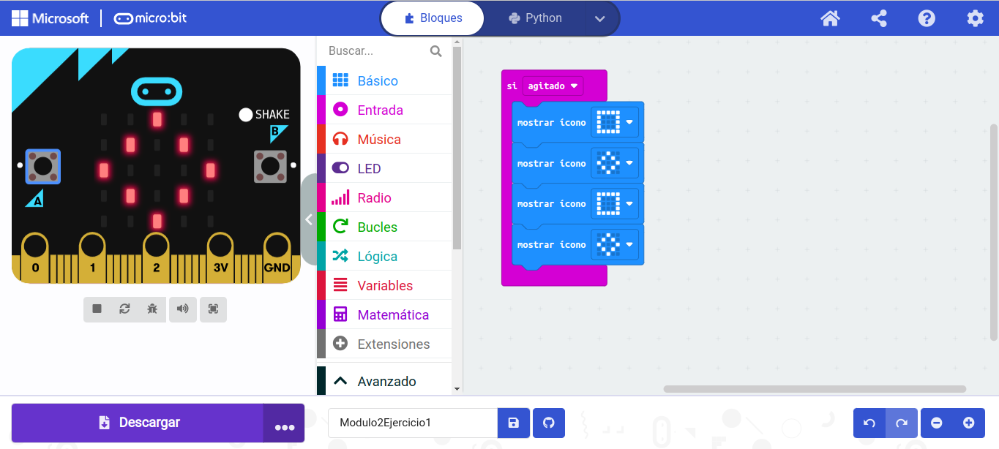
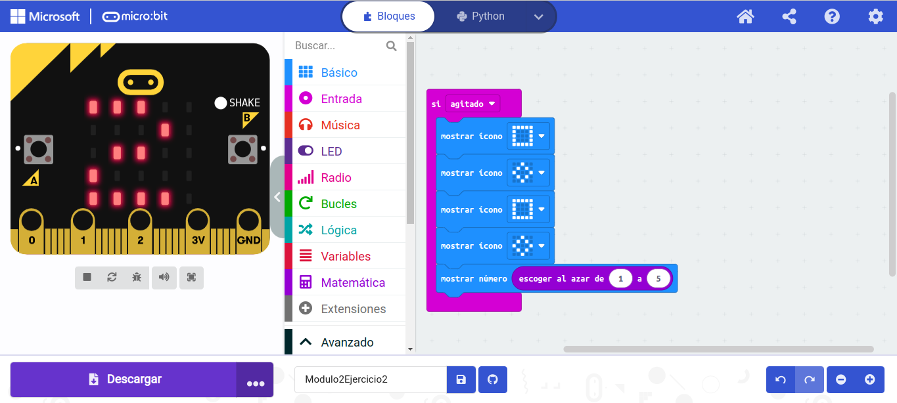
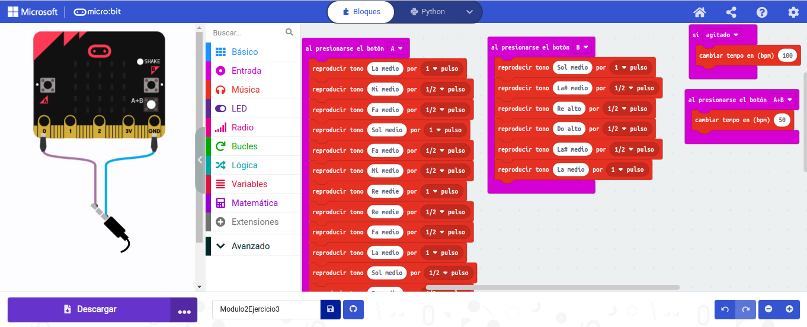

## Ejercicio 1: Consigue que la placa muestre un cuadrado girando al agitar la placa.

## - [`ARCHIVO`](microbit-Modulo2Ejercicio1.hex)

## Ejercicio 2: Añadimos a continuación de la animación del ejercicio anterior, que nos muestre en pantalla un número aleatorio.

## - [`ARCHIVO`](microbit-Modulo2Ejercicio2.hex)

## Ejercicio 3: Toca en la placa, la primera parte de una melodía al presionar el botón A.

## - [`ARCHIVO`](microbit-Modulo2Ejercicio3.hex)
