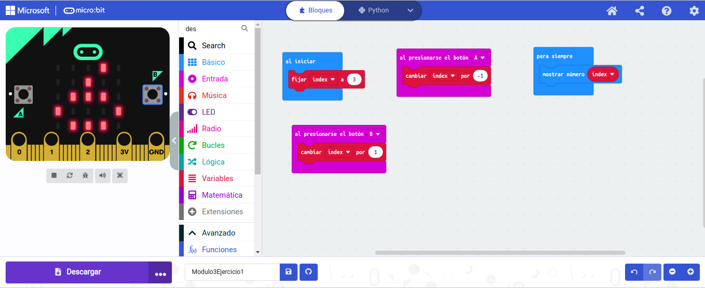
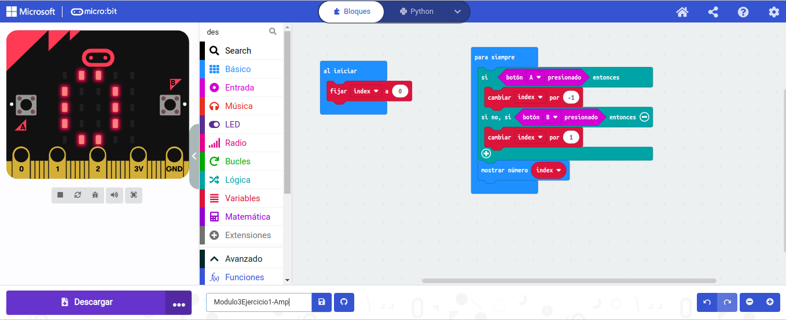
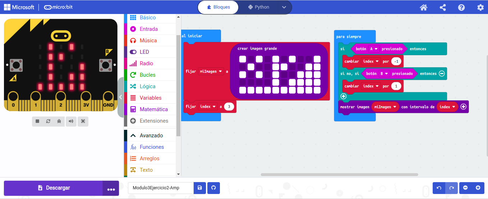

## Actividad 1: Para crea una programa a la placa Micro:bit para que, al presionar el botón B, la variable aumente y, al presionar el botón A, la variable disminuya.

- [ARCHIVO](microbit-Modulo3Ejercicio1.hex)

## Actividad 1 - Ampliación: incluimos en el bloque “para siempre” una condición si.

- [ARCHIVO](microbit-Modulo3Ejercicio1-Amp.hex)

## Actividad 2: Crea una imagen grande y programa la placa para que inicialmente se muestre la parte central de la imagen y, al presionar los botones A y B, la imagen se deslice a la izquierda o a la derecha, respectivamente.

- [ARCHIVO](microbit-Modulo3Ejercicio1-Amp.hex)
