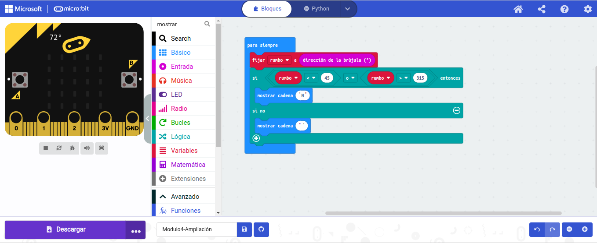
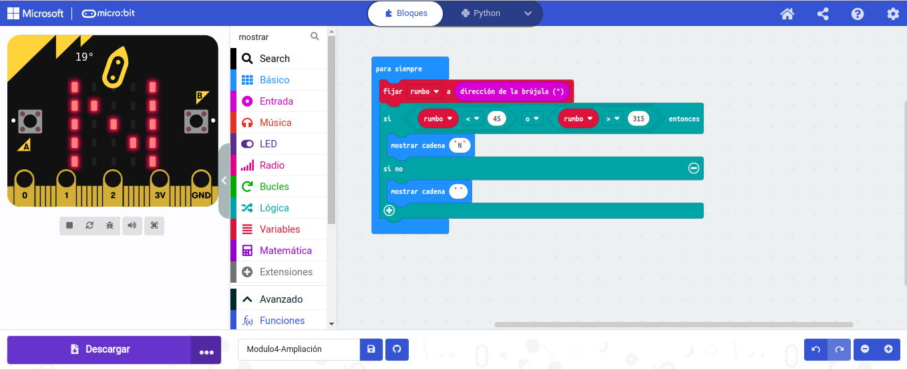

# Brujula al Norte: 
### Esta simple brújula te mostrará en qué dirección está el norte.
### La micro:bit tiene un sensor de brújula llamado magnetómetro que mide campos magnéticos. Puede detectar el campo magnético de la tierra y, por lo tanto, puede ser usado como brújula.
### `IMPORTANTE`: Cuando usas la brújula micro:bit por primera vez tienes que calibrarla. Aparecerá un pequeño juego en la pantalla donde tienes que inclinar el micro:bit para encender cada LED, y con esto estará todo listo

## [ARCHIVO](microbit-Modulo4-Ampliación.hex)
