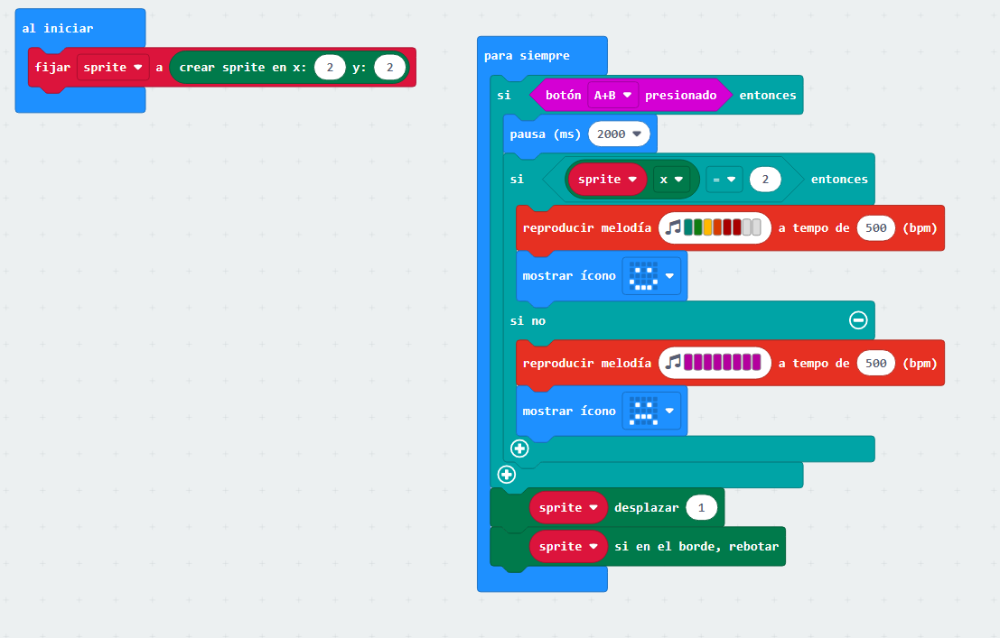
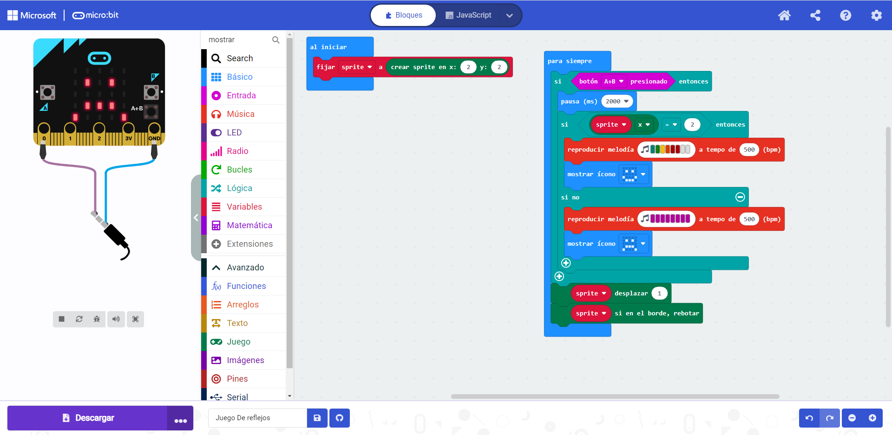

# Proyecto 
Por motivos tecnicos no he podido realizar la grabacion del video, por lo que para compensar, he realizado otra practica, en este caso se trata de un juego sencillo.
### Juego de reflejos
Este juego consiste en, al presionar un boton, tienes que dejar el punto en el cento. Dicho punto de mueve de derecha a izquierda y viceversa, a una velocidad constante y relativmente rápida.
### Explicacion del programa

- Al iniciar: Las luces led empiezan a moverse desde el centro es decir, del 2 del eje x e y, tomando esta posicion como referencia.
- Para siempre: AL presionar, el boton a+b, el led se mantiene durante 2 segundos en la posicion que se ecncontraba al pulsar a+b.
Si el led se encuentra en la posicion de referencia, es decir x = 2, sonará una melodia y aparecerá una cara sonriente. En caso de que el led no se pare en la posicion de referencia, aparecerá otra melodia y una cara triste. El led se desplazará 1 (esto indica la velocidad a la que el led se moverá, si pongo 0.5 el led se mueve a la mitad de velocidad), y por ultimo cuando el led llegue al borde, rebotará, es decir, irá en direccion contraria hasta que se encuentre con el otro borde, rebotará hasta que se pulse el boton a+b.

## - ['ARCHIVO']()
